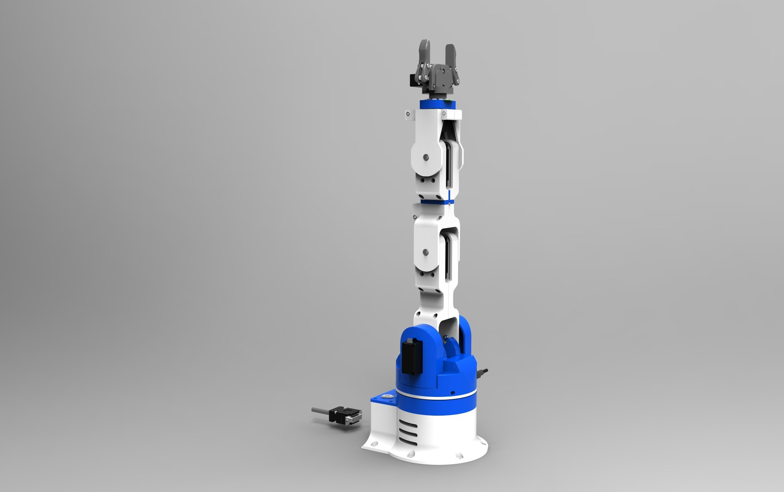

# Tomato Harvesting: An Automation with Machine Learning Approach

## Table of Contents
- [Introduction](#introduction)
- [What are we doing](#what-are-we-doing)
- [Base Research Papers](#base-research-papers)
- [Technology Stack](#technology-stack)
  - [Programming Language](#programming-language)
  - [Editor](#editor)
  - [IDE](#ide)
  - [Libraries](#libraries)
  - [Dataset](#dataset)
- [Dataset's ](#dataset)
- [Further Reading](#further-reading)
  - [YOLO](#YOLO:-You-Look-Only-Once)
    
- [Screenshots](#screenshots)
- [Results](#results)
- [Robot Arm Design and Selection](#robot-arm-design-and-selection)
- [Report](#report)
- [Team](#team)
- [License](#license)
- [Contribution Form](#contribution-form)

## Introduction 

## What are we doing
- To reduce the labour shortage on tomato harvesting.

## Base Research Papers
1. K. N. T. H. a. M. I. Hiroaki Yaguchi, "Development of An Autonomous Tomato Harvesting Robot with," International Conference on Intelligent Robots and Systems (IROS), 2016. 
2. 2. ,. S. M. 2. a. J. H. K. 2. Guoxu Liu 1, "A Mature-Tomato Detection Algorithm Using Machine," International Conference on Machine Learning and Computing (ICMLC), 2019. 
3. X. W. G. W. Z. L. Qingchun Feng, "Design and Test of Tomatoes Harvesting Robot," International Conference on Information and Automation, 2015. 
4. F. z. Chen Huangfei, "Design and research on the End Actuator of Tomato Picking," IOP Conf. Series, 2019. 
5. J. X. Tao Zhu*, "Chassis Design of Tomato Picking Robot in the Greenh," Journal of Physics: Conference Series, 2021.
- [Access the Folder](Research-paper)

## Technology Stack
Our technology stack includes a variety of tools and frameworks, such as Node.js, React, and MongoDB. We chose these technologies for their widespread use in the industry and large developer communities.

  - ### Programming Language
    The primary programming language used in this project is [Specify Language].

  - ### Editor
    The project is developed using [Specify Code Editor].

  - ### IDE
    [Specify Integrated Development Environment (IDE)] is used for development, training, and deployment.

  - ### Libraries
    The project utilizes the following libraries:
    - [Specify Libraries, e.g., TensorFlow, OpenCV]

  - ### Dataset
    The project involves the use of datasets related to tomato harvesting and machine learning.
- [kaggle-Tomato Detection](https://www.kaggle.com/datasets/andrewmvd/tomato-detection)
- [LaboroTomato](https://github.com/laboroai/LaboroTomato/tree/master)
- [TomatOD](https://github.com/up2metric/tomatOD)
## Further Reading
For additional reading, we recommend the following resources:

- [Python Machine Learning](https://www.oreilly.com/library/view/python-machine-learning/9781789955750/)
- [Introduction to 6DOF Robotic Arms with Python](https://www.robotshop.com/community/tutorials/show/introduction-to-6dof-robotic-arms-with-python)
- [MongoDB: The Definitive Guide](https://www.oreilly.com/library/view/mongodb-the-definitive/9781491954461/)
### YOLO: You Look Only Once 
- [yolo foundation](https://www.youtube.com/watch?v=zgbPj4lSc58&list=PL1u-h-YIOL0sZJsku-vq7cUGbqDEeDK0a)
- [yolov4-tiny](https://www.youtube.com/watch?v=XaYRY4EM6is&t=625s)
## Screenshots
Here are some screenshots of our project:

## Results
[Include project results and achievements here.]

## Robot Arm Design and Selection 

In this section, we discuss key considerations for robot arm design and selection. We explore factors such as material, range of motion, and payload capacity. Additionally, we provide insights into the decision-making process and criteria for choosing an appropriate robot arm for tomato harvesting.

### Robot Arm Design Factors

- **Material:** Considerations for selecting materials that ensure durability and efficiency.
- **Range of Motion:** Understanding the required range of motion for effective tomato harvesting.
- **Payload Capacity:** Evaluating the robot arm's ability to handle the weight of harvested tomatoes.

### Selection Criteria

When choosing a robot arm for tomato harvesting, it's essential to take into account...

For more in-depth information on robot arm design, visit [Robot Design Info](https://www.thingiverse.com/thing:2465275)

## Report
[Link to the detailed project report goes here.]

## Team

The project team includes:

- **Mausam Gurung**
  - Role: Project Lead
  - Responsibilities: Coordination and overall project management.
  - GitHub: [MausamGurung](https://github.com/MausamGurung)
  - LinkedIn: [Mausam Gurung](https://www.linkedin.com/in/mausamgurung/)

- **Shubham Bista**
  - Role: Machine Learning Specialist
  - Responsibilities: Implementation of machine learning algorithms for tomato detection.
  - GitHub: [ShubhamBista](https://github.com/ShubhamBista)
  - LinkedIn: [Shubham Bista](https://www.linkedin.com/in/shubhambista/)

- **Symon Shrestha**
  - Role: Robotics Engineer
  - Responsibilities: Design and implementation of the robot arm.
  - GitHub: [SymonShrestha](https://github.com/SymonShrestha)
  - LinkedIn: [Symon Shrestha](https://www.linkedin.com/in/symonshrestha/)

- **Shalon Maharjan**
  - Role: Data Scientist
  - Responsibilities: Analysis of tomato harvesting datasets and model training.
  - GitHub: [ShalonMaharjan](https://github.com/ShalonMaharjan)
  - LinkedIn: [Shalon Maharjan](https://www.linkedin.com/in/shalonmaharjan/)

## License
This project is licensed under the MIT License - see the [LICENSE.md](LICENSE.md) file for details.

## Contribution Form

To contribute to this project, please fill out the following form:

- **Name:**
- **Email:**
- **GitHub Username:**
- **Contribution:**
  - Specify the area of contribution (e.g., bug fix, feature enhancement, documentation).
- **Reason for Contribution:**
  - Share briefly why you want to contribute to the project.
- **Additional Comments:**
  - Any additional information or questions you have.

We welcome contributions in the following areas:
- Bug fixes
- Feature additions
- Documentation improvements
- ...

Please follow our [Contribution Guidelines](CONTRIBUTING.md) for more details.

